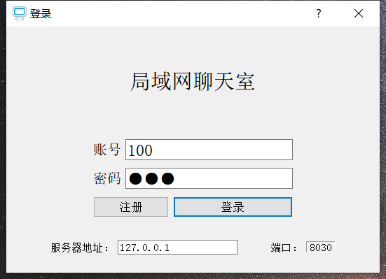
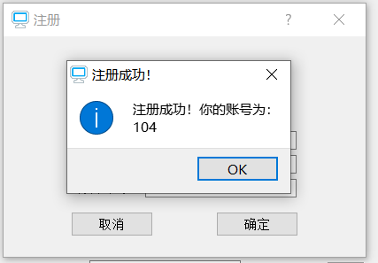
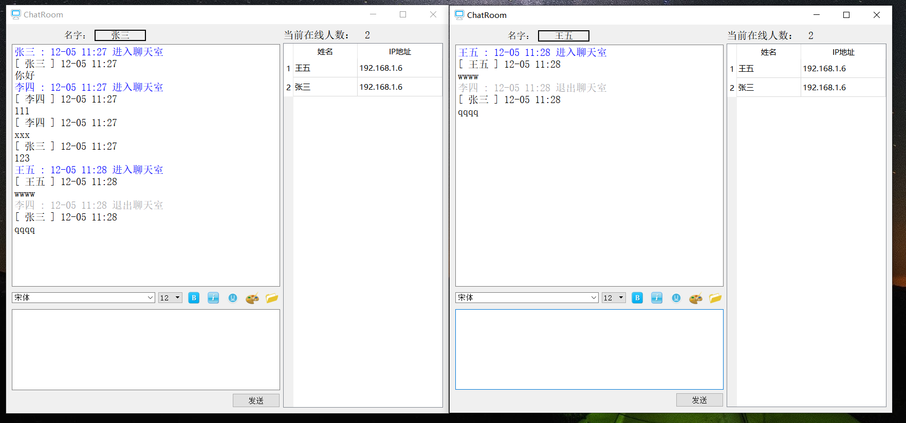
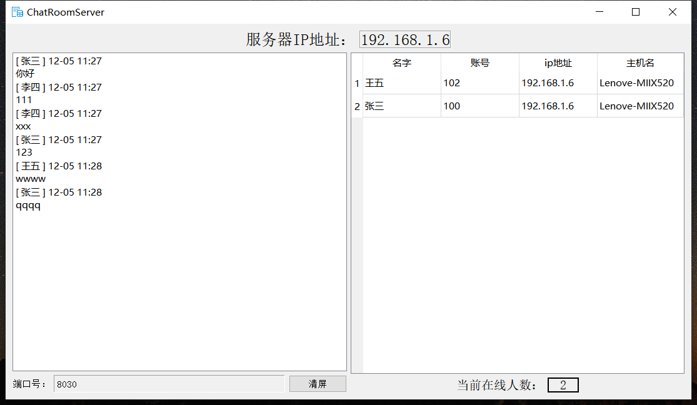

# 介绍
简易Qt局域网聊天室

# 快速启动
- 将 doc/mysql连接器/libmysql.dll 放到Qt5.8.0\5.8\mingw53_32\bin目录下
- 在服务器和客户端都加上socket和sql模块：QT       += core gui network sql
- 新建数据库：chatroom。执行userinfo.sql数据库文件

# 程序演示
## 客户端

## 服务器

# 程序发布
- 使用release构建，将.exe文件放在一个文件目录
